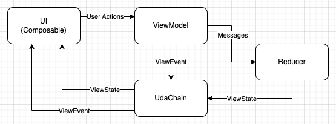

# Critical TechWorks - Android Code Challenge

## Compilation

As requested, this project has two flavors: `bbc` and `globo`. To compile each flavor, you can use the following commands:

* `bbc`: shows headlines from BBC News
```bash
./gradlew app:assembleBbcDebug
```

* `globo`: shows headlines from Globo (Brazilian news network)
```bash
./gradlew app:assembleGloboDebug
```

## Architecture

This project was built using a Unidirectional architecture, a simplified version of MVI (Model-View-Intent). 
The main components are:

* `UI`: represented by the each screen's root `Composable`s, like `SourceListScreen` or `HeadlineDetailsScreen`. It's responsible for rendering the UI (`ViewState`) and sending user actions to the `ViewModel` and also handling `ViewEvents`.
* `ViewModel`: processes user actions and submits Messages or ViewEvents as well as handles side-effects, like fetching data from the network.
* `Reducer`: processes Messages and updates the `ViewState`.
* `UdaChain`: links the other 3 components together and has a few responsibilities:
  * Receives the `Messages` and forwards them o the `Reducer`
  * Receives and caches updated `ViewStates` and allows the UI to listen to `ViewStates` changes via a Kotlin Flow.
  * Receives `ViewEvents` from the `ViewModel` and forwards them to the `UI`.

Here's a diagram of the architecture:



## Dependencies

This project uses the following 4rd-party dependencies:

* Retrofit + OkHttp + Moshi: for network requests and JSON parsing
* Coil: for image loading
* Mockk: for mocking objects in tests
* Robolectric: for tests that require Android framework classes (like Biometrics)

It also uses a some Jetpack/Google libraries, such as Dagger Hilt for dependency injection.
